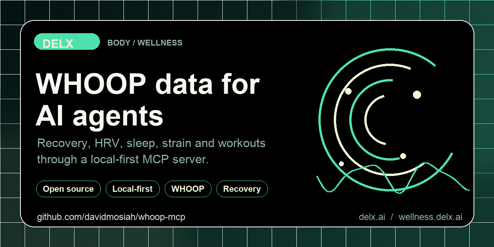

<!-- delx-wellness header v2 -->
<h1 align="center">WHOOP MCP</h1>

<div align="center">
  
</div>

<h3 align="center">
  Give your AI agent your WHOOP recovery, sleep, strain and HRV &mdash; without copy-pasting from the app.<br>
  Local-first MCP server &mdash; <strong>tokens never leave your machine</strong>.
</h3>

<p align="center">
  <a href="https://www.npmjs.com/package/whoop-mcp-unofficial"></a>
  <a href="https://www.npmjs.com/package/whoop-mcp-unofficial"></a>
  <a href="LICENSE"></a>
  <a href="https://wellness.delx.ai/connectors/whoop"></a>
</p>

<p align="center">
  <a href="https://github.com/davidmosiah/whoop-mcp/stargazers"></a>
  <a href="https://modelcontextprotocol.io"></a>
  <a href="https://github.com/davidmosiah/delx-wellness-hermes"></a>
  <a href="https://github.com/davidmosiah/delx-wellness"></a>
</p>

> ⚡ **One-command install** with [Delx Wellness for Hermes](https://github.com/davidmosiah/delx-wellness-hermes):
> `npx -y delx-wellness-hermes setup` &mdash; preconfigures this connector and the other 8 in a dedicated Hermes profile.
>
> Or wire it standalone into Claude Desktop / Cursor / ChatGPT Desktop &mdash; see the install section below.

---

<!-- /delx-wellness header v2 -->

**Local-first MCP server that connects AI agents to your WHOOP recovery, sleep, strain and HRV data.**

> **Unofficial project.** Not affiliated with, endorsed by or supported by WHOOP, Inc. WHOOP is a trademark of its respective owner. Use this only with your own WHOOP account and in line with WHOOP's Developer Terms.

Built by [David Mosiah](https://github.com/davidmosiah) for people who use Claude, Cursor, Hermes, OpenClaw or other MCP-compatible agents to think about training, sleep and recovery — without copy-pasting numbers from the WHOOP app.

Part of [Delx Wellness](https://github.com/davidmosiah/delx-wellness), a registry of local-first wellness MCP connectors.

> If this connector helps your agent workflow, please star the repo. Stars make the project easier for other AI builders to discover and help Delx keep shipping local-first wellness infrastructure.

## Why this exists

WHOOP gives you rich physiology — recovery score, HRV, sleep stages, strain — but it lives behind an OAuth API and a closed app. Bringing it into your AI agent today means writing the OAuth dance yourself, storing tokens safely, normalizing responses and handling pagination.

This package does all of that locally, exposes WHOOP through the Model Context Protocol, and lets any MCP-compatible agent read your WHOOP context with one config snippet. Tokens never leave your machine.

## Setup in 60 seconds

You'll need a WHOOP Developer app ([create one here](https://developer.whoop.com/)) with redirect URI `http://127.0.0.1:3000/callback`.

```bash
npx -y whoop-mcp-unofficial setup    # interactive: paste client id + secret
npx -y whoop-mcp-unofficial auth     # opens browser, captures the OAuth code
npx -y whoop-mcp-unofficial doctor   # verifies you're ready
```

Then add this to your MCP client config:

```json
{
  "mcpServers": {
    "whoop": {
      "command": "npx",
      "args": ["-y", "whoop-mcp-unofficial"]
    }
  }
}
```

For Claude Desktop, run `setup --client claude` and the snippet is written for you.

## Try it with your agent

Three things to ask first:

```text
Use whoop_connection_status to check setup, then run whoop_daily_summary.
Give me a 5-line operating brief for today.
```

```text
Call whoop_weekly_summary with response_format=json. Identify the top
bottleneck and give me a sleep + training plan for next week.
```

```text
Use the whoop_daily_performance_coach prompt. Focus on whether I should train
hard today.
```

## Data availability

This package uses the official WHOOP OAuth API (v2). It does not access raw device sensor streams.

| Data | Available | Notes |
|---|:---:|---|
| Recovery score, HRV, RHR, SpO2, skin temp | ✓ | When WHOOP returns a scored recovery |
| Sleep sessions + stages + performance | ✓ | All scored sleep records |
| Cycles + day strain + kilojoules | ✓ | Physiological cycles |
| Workouts + sport + heart-rate zones | ✓ | All recorded workouts |
| Profile + body measurements | ✓ | Height, weight, max HR |
| Continuous heart-rate / device telemetry | — | Not exposed by WHOOP's public API |
| Live BLE heart-rate listening | — | This package is not a Bluetooth listener |

When this README says `raw`, it means the upstream WHOOP API JSON for a supported endpoint — not raw sensor samples.

## Tools

**Start with these:**

- `whoop_connection_status` — verify local setup before calling WHOOP
- `whoop_data_inventory` — inventory supported data domains, scopes, privacy modes and recommended first calls without calling WHOOP APIs.
- `whoop_daily_summary` — readiness, sleep, load and action candidates for today
- `whoop_weekly_summary` — scorecard, comparison vs prior week, next-week plan

**Auth & diagnostics**

- `whoop_capabilities`, `whoop_agent_manifest`, `whoop_privacy_audit`, `whoop_cache_status`
- `whoop_get_auth_url`, `whoop_exchange_code`, `whoop_revoke_access`

**Profile**

- `whoop_get_profile`, `whoop_get_body_measurements`

**Collections** (paginated, with `start`/`end` filters and privacy-mode override)

- `whoop_list_recoveries`, `whoop_list_sleeps`, `whoop_list_cycles`, `whoop_list_workouts`

Common collection params: `start`, `end`, `limit` (max 25), `next_token`, `all_pages`, `max_pages`, `response_format` (`markdown`/`json`), `privacy_mode` (`summary`/`structured`/`raw`).

**Single records by id**

- `whoop_get_cycle`, `whoop_get_sleep`, `whoop_get_workout`
- `whoop_get_cycle_sleep`, `whoop_get_cycle_recovery`

## Prompts

- `whoop_daily_performance_coach` — practical daily plan from today's signals
- `whoop_weekly_training_review` — week comparison + next-week plan
- `whoop_sleep_recovery_investigator` — investigate sleep ↔ recovery patterns

Each accepts `timezone` (IANA, default `UTC`).

## Resources

- `whoop://capabilities`
- `whoop://summary/daily`, `whoop://summary/weekly`
- `whoop://latest/recovery`, `whoop://latest/sleep`, `whoop://latest/cycle`

## Privacy & security

- OAuth tokens are stored in `~/.whoop-mcp/tokens.json` with `0600` permissions and are never returned by tools.
- Refresh-token rotation uses a lock file to avoid concurrent refresh races.
- `whoop_revoke_access` is the only destructive tool — it deletes local tokens and revokes the grant.
- `WHOOP_PRIVACY_MODE` defaults to `structured`. Raw WHOOP API payloads are opt-in via `raw` mode or per-call override.
- The MCP client never sees access or refresh tokens.
- This is **not medical advice**. The server exposes user-authorized data for personal AI workflows, not diagnosis or treatment.

## Configuration

`setup` writes most of these into `~/.whoop-mcp/config.json` (`0600`). Manual env override is supported:

```bash
WHOOP_CLIENT_ID=…
WHOOP_CLIENT_SECRET=…
WHOOP_REDIRECT_URI=http://127.0.0.1:3000/callback

# Optional
WHOOP_SCOPES="read:recovery read:cycles read:workout read:sleep read:profile read:body_measurement"
WHOOP_PRIVACY_MODE=structured        # summary | structured | raw
WHOOP_CACHE=sqlite                   # optional read-through cache
WHOOP_TOKEN_PATH=~/.whoop-mcp/tokens.json
WHOOP_CACHE_PATH=~/.whoop-mcp/cache.sqlite
```

## Hermes / remote setup

```bash
npx -y whoop-mcp-unofficial setup --client hermes --no-auth
npx -y whoop-mcp-unofficial auth                       # run locally if browser auth is needed
npx -y whoop-mcp-unofficial doctor --client hermes
hermes mcp test whoop
```

After Hermes config changes, use `/reload-mcp` or `hermes mcp test whoop`. Don't restart the gateway for normal data access.

If browser OAuth has to happen on a different machine than Hermes, run `auth` locally and copy `~/.whoop-mcp/tokens.json` to the server with `chmod 600`.

## Requirements

- Node.js 20+
- A WHOOP Developer app with redirect URI `http://127.0.0.1:3000/callback`

Default OAuth scopes:

```text
read:recovery read:cycles read:workout read:sleep read:profile read:body_measurement
```

## Development

```bash
git clone https://github.com/davidmosiah/whoop-mcp.git
cd whoop-mcp
npm install
npm test
npm run build
```

Test with MCP Inspector:

```bash
npx @modelcontextprotocol/inspector node dist/index.js
```

Optional local HTTP transport:

```bash
WHOOP_MCP_TRANSPORT=http WHOOP_MCP_PORT=3000 node dist/index.js
curl http://127.0.0.1:3000/health
```

## Docs

- [Quickstart](docs/quickstart.md)
- [Privacy model](docs/privacy.md)
- [FAQ](docs/faq.md)
- [Resources & prompts](docs/resources-prompts.md)
- [Roadmap](docs/roadmap.md)

## Links

- npm: <https://www.npmjs.com/package/whoop-mcp-unofficial>
- Docs site: <https://wellness.delx.ai/connectors/whoop>
- Legacy docs: <https://whoopmcp.vercel.app/>
- GitHub Pages mirror: <https://davidmosiah.github.io/whoop-mcp/>
- Delx Wellness registry: <https://github.com/davidmosiah/delx-wellness>
- Connector quality standard: <https://github.com/davidmosiah/delx-wellness/blob/main/docs/connector-quality-standard.md>
- Official WHOOP API docs: <https://developer.whoop.com/api/>

<!-- delx-wellness see-also -->

## See also

The full [Delx Wellness](https://wellness.delx.ai) connector library:

| Provider | Package | Repo |
|---|---|---|
| WHOOP | [`whoop-mcp-unofficial`](https://www.npmjs.com/package/whoop-mcp-unofficial) | [whoop-mcp](https://github.com/davidmosiah/whoop-mcp) |
| Oura | [`oura-mcp-unofficial`](https://www.npmjs.com/package/oura-mcp-unofficial) | [ouramcp](https://github.com/davidmosiah/ouramcp) |
| Garmin | [`garmin-mcp-unofficial`](https://www.npmjs.com/package/garmin-mcp-unofficial) | [garminmcp](https://github.com/davidmosiah/garminmcp) |
| Strava | [`strava-mcp-unofficial`](https://www.npmjs.com/package/strava-mcp-unofficial) | [strava-mcp](https://github.com/davidmosiah/strava-mcp) |
| Fitbit | [`fitbit-mcp-unofficial`](https://www.npmjs.com/package/fitbit-mcp-unofficial) | [fitbitmcp](https://github.com/davidmosiah/fitbitmcp) |
| Withings | [`withings-mcp-unofficial`](https://www.npmjs.com/package/withings-mcp-unofficial) | [withingsmcp](https://github.com/davidmosiah/withingsmcp) |
| Apple Health | [`apple-health-mcp-unofficial`](https://www.npmjs.com/package/apple-health-mcp-unofficial) | [apple-health-mcp](https://github.com/davidmosiah/apple-health-mcp) |
| Polar | [`polar-mcp-unofficial`](https://www.npmjs.com/package/polar-mcp-unofficial) | [polarmcp](https://github.com/davidmosiah/polarmcp) |
| Nourish (nutrition) | [`wellness-nourish`](https://www.npmjs.com/package/wellness-nourish) | [wellness-nourish](https://github.com/davidmosiah/wellness-nourish) |

**One-command setup for Hermes** — preconfigures every connector above plus wellness skills + onboarding: [`delx-wellness-hermes`](https://github.com/davidmosiah/delx-wellness-hermes).

<!-- /delx-wellness see-also -->

## License

MIT — see [LICENSE](LICENSE).

## Disclaimer

This software is provided as-is. It is not a medical device, does not provide medical advice, and should not be used for diagnosis or treatment. Always consult qualified professionals for medical concerns.
